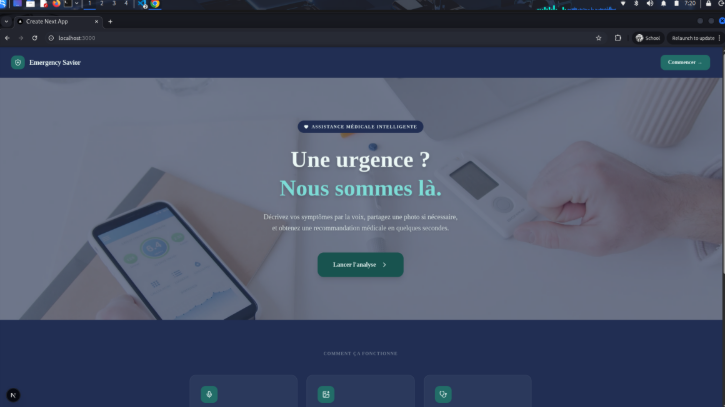
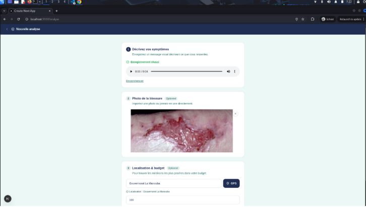
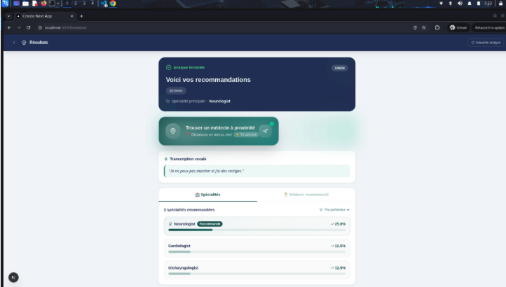
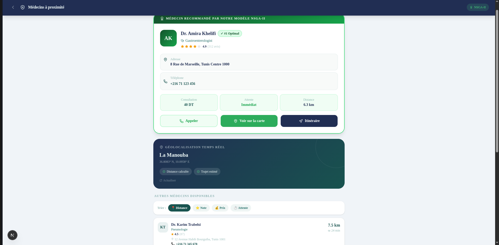
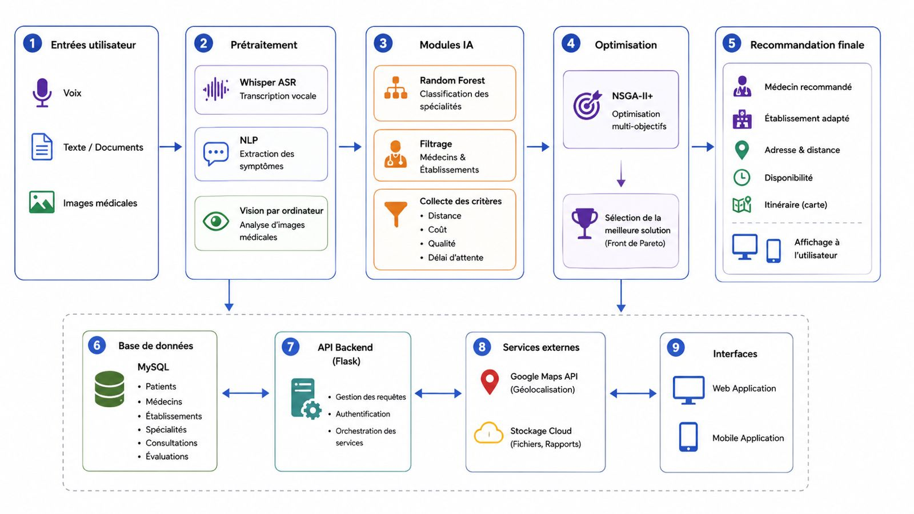
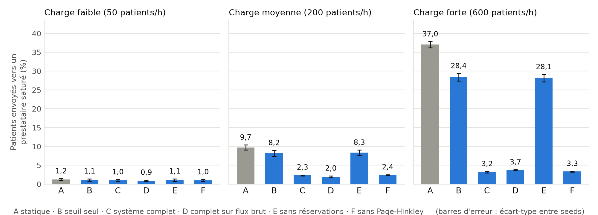

# AI Emergency Savior

[](https://www.python.org/)
[](https://fastapi.tiangolo.com/)
[](https://nextjs.org/)
[](https://huggingface.co/spaces/youssef0081/emergency-savior-output)
[](#tests)

AI Emergency Savior turns a patient's spoken or written description of their symptoms into a medical recommendation: an estimated severity level, the most relevant medical specialty, and a ranked Top 3 of healthcare providers. It works in French and English and targets the Tunisian healthcare context (504 doctors, 22 specialties, 24 cities).

This is a research prototype. Every number below comes from a versioned result file, and the limits are stated next to the results. It is not a medical device and must not be used for real triage.

[Pipeline](#pipeline) · [Results](#evaluation-results) · [Repository layout](#repository-layout) · [Getting started](#getting-started) · [Reproducing the results](#reproducing-the-results) · [Limitations](#limitations)

---

## Screenshots

<table>
  <tr>
    <td></td>
    <td></td>
  </tr>
  <tr>
    <td></td>
    <td></td>
  </tr>
</table>

<p align="center">
  <br/>
  <sub>System architecture, from audio input to the operator interface</sub>
</p>

---

## Pipeline

| Step | What it does | Where it runs |
|---|---|---|
| 1. Speech to text | Transcribes the patient's audio with Whisper | Hugging Face Space [`emergency-savior-speech`](https://youssef0081-emergency-savior-speech.hf.space) |
| 2. Symptom extraction | Maps the text to a closed list of 300 symptoms. French uses a direct lexicon (271 symptoms); English uses synonyms and fuzzy matching. Negated symptoms are ignored | Hugging Face Space [`emergency-savior-output`](https://huggingface.co/spaces/youssef0081/emergency-savior-output) |
| 3. Severity | Rule-based estimate: LOW, MEDIUM, HIGH or CRITICAL | same Space |
| 4. Specialty | Scores 22 specialties as `0.60 × tree score + 0.40 × importance score` and returns the Top 3 | same Space |
| 5. Provider ranking | Pareto sort over 7 objectives (quality, cost, waiting time, slots, same city, insurance, teleconsultation), then a weighted compromise score inside each front | same Space |
| 6. Top 3 | Three providers, spread across specialties when the classification is uncertain | same Space |

The FastAPI backend (`backend/main.py`) orchestrates the calls and exposes the result to the Next.js frontend. An optional scene-analysis module is also called by the backend; it is outside the scope of the evaluation.

A separate research module, `backend/realtime/`, studies what happens after a recommendation: providers fill up because the system recommended them. It covers noise filtering, drift detection and saturation handling. It is validated in simulation only and is not connected to the live service.

### Component status

| Component | Status |
|---|---|
| Symptom extraction, severity, specialty, provider ranking | Deployed on the Space, evaluated locally and in production |
| Hospital recommendation (`backend/hospital.py`) | API routes active, tested on a test dataset |
| Noise filtering, drift detection, saturation handling (`backend/realtime/`) | Simulation only |
| Speech-to-text and scene analysis | Deployed, not evaluated in this repository |

---

## Evaluation results

All figures, their source files and their caveats are indexed in [`backend/RESULTS_INDEX.md`](backend/RESULTS_INDEX.md). The detailed reports are in [`backend/testing/results/`](backend/testing/results/) and [`backend/realtime/results/`](backend/realtime/results/) (written in French).

### Recommendation pipeline

Hand-written test cases, measured on the deployed service (82 requests, 82 answers).

| Test set | Top-1 specialty | Expected specialty in Top 3 | Symptom recall |
|---|---|---|---|
| French, held-out control set (24 cases) | 83.3 % | 100 % | 0.697 |
| French, original set (29 cases) | 82.8 % | 100 % | 0.973 |
| English (29 cases) | 44.8 % | 58.6 % | 0.274 |

- Before the French lexicon was added, the French path returned a correct specialty in 1 case out of 29.
- English is the weak path: the extractor finds no symptom in 8 cases out of 29.
- The service answers in 226 to 326 ms on average, network included.

### Provider ranking and severity

- **Ranking.** In the original ranking, making a doctor ten times more expensive improved their rank in 28.6 % of trials (144 of 504). After the fix this never happens (0 of 504), and the same holds for a one-year waiting time or a quality score set to zero.
- **Severity.** On 24 annotated cases the estimated level is exact in 66.7 % of cases and within one level in 83.3 % (French: 75 % and 100 %; English: 58.3 % and 66.7 %).

### Performative adaptation (simulation)

A closed-loop simulator replays one day of patients over the 504 providers. Each provider's true occupancy is the ground truth and is never shown to the system. Mean ± standard deviation over seeds 7, 1 and 42.

| At high load (600 patients per hour) | Static ranking | Full adaptive system |
|---|---|---|
| Patients sent to a saturated provider | 37.0 ± 0.8 % | 3.2 ± 0.2 % |
| Patients refused for lack of capacity | 26.0 ± 0.3 % | 2.1 ± 0.1 % |
| Share of patients sent to the 3 most recommended providers of a specialty | 82.6 ± 0.1 % | 33.3 ± 0.9 % |
| Quality score of the first recommended provider (out of 10) | reference | −0.72 ± 0.02 |

- The static ranking concentrates patients on three providers per specialty, which saturates them while average occupancy is only 36 %.
- Almost all of the gain comes from provisional reservations, which count a recommendation as load before the patient arrives.
- The Page-Hinkley trend signal adds no measurable benefit, and the noise filter improves patient outcomes only slightly. Both results are reported as such.

<p align="center">
  <br/>
  <sub>Share of patients sent to a saturated provider. A static, B threshold only, C full system, D full system on the raw feed, E without reservations, F without Page-Hinkley.</sub>
</p>

Earlier phases of the same module:

- **Noise filtering.** Deduplication precision 0.994 and recall 1.000; confirmation filter 1.000 and 1.000; anomaly detection is weak (precision 0.542, recall 0.523, on 6 to 9 injected spikes per seed).
- **Drift detection.** After tuning, ADWIN and Page-Hinkley both reach an episode-level F1 of at least 0.98 on simulated drifts. Page-Hinkley detects an abrupt drift in 10.8 points on average against 24.3 for ADWIN.

---

## Repository layout

```
AI-Emergency-Savior/
├── frontend/                  Next.js operator web app
├── backend/
│   ├── main.py                FastAPI app: /analyze, /optimize, /analyze-full, /health
│   ├── hospital.py            Hospital recommendation: /api/hospitals/recommend
│   ├── RESULTS_INDEX.md       Final figures of every phase, with source and caveat
│   ├── testing/               End-to-end evaluation of the recommendation pipeline
│   │   ├── results/           Reports and raw results
│   │   └── to_deploy_round2/  Copy of the Space files for the latest release
│   └── realtime/              Noise filtering, drift detection, saturation, simulators
│       └── results/           Reports, raw results and figures
└── asr-finetuning/            Whisper + LoRA fine-tuning scripts
```

The symptom extraction, classification and ranking code lives in the Hugging Face Space [`youssef0081/emergency-savior-output`](https://huggingface.co/spaces/youssef0081/emergency-savior-output), not in this repository.

### External services

| Constant in `backend/main.py` | Space | Purpose |
|---|---|---|
| `HF_AUDIO_URL` | [`emergency-savior-speech`](https://youssef0081-emergency-savior-speech.hf.space) | Speech-to-text |
| `HF_OPT_URL` | [`emergency-savior-output`](https://youssef0081-emergency-savior-output.hf.space) | Symptoms, severity, specialty, providers |
| `HF_CV_URL` | [`model-cv-pcd`](https://azizgharbi1-model-cv-pcd.hf.space) | Scene analysis (optional) |

---

## Getting started

Requirements: Python 3.10 or later, Node.js 18 or later.

### Backend

```bash
cd backend
python -m venv .venv
source .venv/bin/activate        # Windows: .venv\Scripts\activate
pip install -r requirements.txt
uvicorn main:app --reload
```

The API runs on http://localhost:8000, with interactive documentation at http://localhost:8000/docs.

### Frontend

```bash
cd frontend
npm install
npm run dev
```

The app runs on http://localhost:3000. It reads the backend address from `NEXT_PUBLIC_API_URL` and falls back to `http://localhost:8000`.

---

## Reproducing the results

### Tests

```bash
cd backend
python -m pytest testing realtime
```

The suite has 177 tests. Tests of the recommendation pipeline and of the adaptation layer need a local clone of the Space; they are skipped when it is missing.

```bash
git clone https://huggingface.co/spaces/youssef0081/emergency-savior-output spaces_src/emergency-savior-output
```

Run this from the repository root, or set `EMERGENCY_SAVIOR_OUTPUT_SRC` to the path of an existing clone.

### Evaluations

Run from `backend/`.

| Command | What it measures | Needs |
|---|---|---|
| `python -m testing.run_fix_evaluation` | Pipeline accuracy before and after the French, negation and Top 3 fixes | Space clone |
| `python -m testing.run_round2_evaluation` | Ranking monotonicity and severity | Space clone |
| `python -m testing.run_deployed_evaluation` | The same test cases against the live service | Network |
| `python -m realtime.run_evaluation` | Noise filtering | — |
| `python -m realtime.run_drift_tuning` then `run_drift_evaluation` | Drift detection | — |
| `python -m realtime.run_feedback_tuning` then `run_feedback_evaluation` | Performative adaptation, tables and figures | Space clone, about 20 minutes |

Simulations are evaluated on seeds 7, 1 and 42. Parameters are tuned on separate seeds (100, 101, 102).

### ASR fine-tuning

The scripts in `asr-finetuning/` adapt Whisper to emergency calls with pseudo-labels and LoRA (rank 8, alpha 32, on `q_proj` and `v_proj`). They expect a local Whisper checkpoint in `./whisper_model`.

```bash
cd asr-finetuning
pip install torch transformers peft datasets librosa evaluate
python prep_pseudo.py     # transcribes raw audio into pseudo_911.json
python fine_tune.py       # trains the LoRA adapters
```

The fine-tuned model is not evaluated in this repository.

---

## Limitations

- **Test data.** The test cases and their expected answers were written by the project authors, not by clinicians. Most sets contain one case per specialty.
- **English.** The English extractor recovers about a quarter of the expected symptoms, which caps accuracy at 44.8 %.
- **Classifier.** No trained model runs at inference time; specialty scores are computed from importance tables stored in spreadsheets.
- **Ranking.** The weights of the compromise score are design choices, not calibrated values: there is no clinical outcome data to calibrate them. Distance is reduced to "same city or not".
- **Real-time module.** Its results come from simulators written for this project. Provider capacity, arrival rates and patient behaviour are assumptions. The module shows a mechanism, not real-world effectiveness.
- **Not evaluated.** Speech-to-text and scene analysis.

The full list, with the points where the implementation differs from the paper's description, is in [`backend/RESULTS_INDEX.md`](backend/RESULTS_INDEX.md).

---

## License

This project is intended for academic and research use. No license file is included in the repository yet.
